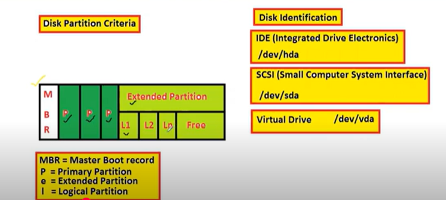

# Managing Partition & File System

* what is partition ?
    - partitions means to dived single hard drive into that many logical drivers 
* **Disk partition Criteria**


    - in the Extended partition dived into multipul logical partitions 
    - `fdisk -l` this command help on disk partitions 
    - in production env must flowon `3P+1E or 1P +1E`
    - any raw disk not more then 3P Primary extended
    - Logical partions created under the Extended Partions 
* **Disk Identification**

    - IDE (Integrated Drive Electronics) `/dev/hda`
    - SCSI (Small Computer System Interface) - `/dev/sda`
    - Virtual Drive - `/dev/vda`
* **What is file system? Types of file system ?**
    - check the filesystem on Linux server `mkf`
* **Types of file System**
    - ext2
        - Ext2 stands for second extended file system
        - Ext2 does not have journaling feature
        - Maximum individual file size can be form 16GB to 2TB
    - ext3 
        - Ext3 stands for third extended file system 
        - The main benefit of ext3 is that it allows journaling
        - Maximum individual file size can be from 16GB to 2TB 
    - ext4 
        - Ext4 stands for fourth extended file system
        - Supports huge individual file size and overall file system size.
        - Maxmum individual file size can be from 16GB to 16TB
    - xfs
        - The XFS file system is an extension of the extent file system
        - The XFS is a high preformance 64-bit jouraling file system
        - XFS supports maximum file system size of 8 exbibytes for the 64-bit file system
- Journaling feature --> it is supporting on backup and filesytem is crashed rollback is supporting on journaling feature 

* **Mounting**

* df -h --> show the mounted file system in partitions 
* cat /etc/fstab --> partitions is mounted on permintly on in files 
cat /etc/mtab ---> this is dynamic file this show the temporary mounted files, when the restart linux server this information will be lost 


### Commands 

* `fdisk -l // parted -l`           --> To view the exting partition 
* fdisk (disk name)                 --> Partition Administration using fdisk
* n                                 --> Creating a new partitions 
* w                                 --> Saving the partition 
* partprobe /dev/sdc                --> Updating the partition table without restaring system 
* mkfs.ext4 /dev/sdc1               --> Formating a partition with ext4 file sytem 
* Mounting                          --> Temporary (/etc/mtab) & Permanent(/etc/fstab)
* unmount /directory                --> Un-mounting a directory from partition
* mount -a                          --> Mount all the file system of /etc/fstab


### Scan the raw disk on SCSI

```bash
echo "---">/sys/class/scsi_host/host0/scan
#-> the three dash("---") of the command act as wildcards meaning rescan everything. Remember that the three values normally stand for channel, SCSI target ID, and LUN.
#-> Then you will scan every iscsi disk found and scan after every scanning if the new disk was detected. it means

echo "---">/sys/class/scsi_host/host0/scan 
echo "---">/sys/class/scsi_host/host1/scan
echo "---">/sys/class/scsi_host/host2/scan
```

* Q. how we can scan a LUN
    - with out restarting disk system scan disk using above commands 

* after disk is added on Linux server create partitions using on command `fdisk (disk name) /dev/sda` 
* create disk partions enter `n`, create how many partitions Entier the cylinders(3P+1E), partitions enter the cylinders 
* check the partitions enter the `p`  
* after create a extended partions, create a logical partitions `n` type `l`
* save this above informations enter `w`
* creating partitions table update on partitions table without restarting system `partprobe /dev/sdc` or `partx -a` or `kpartx` 
* check the disk was add or not `fdisk -l`
* check the partitions on Linux using this command `lsblk`

* creating files system, after formate the file system `mkfs.ext4 /dev/sdc1`
* after formate is finshing mount the some where 
* mouning two types 
      * temporary mounting 
      * Permanent mounting 
* `mount /dev/sdc1 /linuxdate` mounting Linux data folder. check that mounted or not using command `df -h`. this is temporary mounting
* all the runtime information / runtime informations  date under goes on `/etc/mtab`
* make this permanent mounting on `/etc/fstab`

* Q. /etc/fstab how many fields there 
        1. frist field is nothing but `devices name`
        2. second field is `mount point`
        3. third field is `file system name`
        4. mount options 
        5. reaming parts `dumping` and `sqences`

* Q. what are the filesytem is mounted you can backup on this how 

* unmount filesytem `umount /linuxdata`
* `mount -a` this show the all mounted stuf 
* delete a partitions using below this 

```bash
    fdisk /dev/sdc
    p
    d # delete
    # enter number which on delete  
    # now check 
    fdisk 
    #partx -a
    # update partitions table 
    partprobe /dev/sdc5

```
## issues faceing manging partitions 
* **device is busy**
      * unmounted the disk on folder on the time this will showing 
      * check the which user working on file system using command like `fuser -cu /dev/sdc1`
      * kill that user working file use `fuser -ck /dev/sdc1`
      * check the current working dir on current user means `pwd`


# playing with swap partitions 

* how to use swap,extended swap partions, add remove the swap aprtitions 

## commands 

* free -m                     --> To see the memory size and swap memoey
* swapon -s                   --> To see swap usage
* mkswap(partitions name)     --> To formate the partitions with swap file sytem 
* swapon (partitions name)    --> To activate the swap space use
* swapoff(partition name)     --> To deactivate the swap space use

* physical memory means RAM
      * RAM is olYtail memory 
      * RAM is primery memory
      * it is fastest memory
      * swap is taken form form hard disk 
      * Hard Disk (Secondary Memory)
      * RAM is less or equal 2 GB Calculation SWAP=2* RAM SIZE
      * RAM is more than 2GB Calcutations SWAP = 2GB + Size of RAM
* `free -m` this command will show the swap memory and RAM
* if you want to clear the swap memory clear the `cached`
* check the swap memory usage on linux server use this command called `swapon -s`

* Q. how would be create virtuval swap memory 

* create swap partitions 

```
# check the partitions 
fdisk /dev/sdc1
Enter: m (for help)
Enter: p (print the partitions table)
Enter: l (list of partitions)
NOte: list of partitions show the partitions ids 
      - by default paartions on Linux is 83
      - swap partitions id is 82
 * now we can change the partitions id 83 to 82 
 Enter: p and t (Change a partitions table)
 now asking for partitions number ; 2 (means taken form /dev/sdc2)
 Hex code: '82'
 * now change the partitions on 83 to 82 check the 'p'
 * now save use 'w'
 * update partitions probe table "partprobe /dev/sdc2".
 * check the "fdisk -l"
 * formate the swap partitions use command is "mkswap /dev/sdc2" 
 * activate swap partitions is command is "swapon -s " use "swapon /dev/sdc2"
```
* swap memory cannot incresed on exting partions 
* addon the addtional partitions  
* swap memory incresed that is addtional partitions not in the exting partitions 

