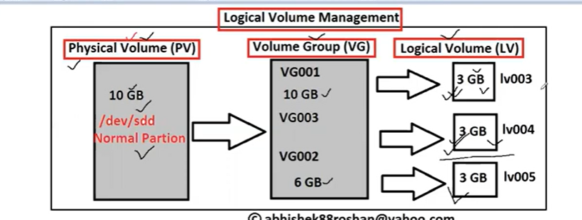
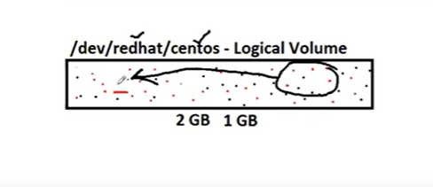
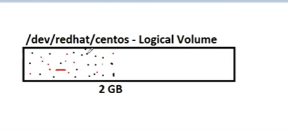

# Logical Volume Management(LVM) in Linux

NOTE: before read the document you know about disk partitions. [please read](https://github.com/dhille98/RedHat-Certified-Linux-Administrator/blob/main/classes/Disk_partitions.md) 

* **What do you understand by LVM ?**
        - it is virtuvlalised disk 
        - logical volume is nothing but giving the flexbuilty
        - giving on mechanisam where able to expend or able to reduce or able reduce 
        - you can move on one partitions to another partitions 
        - Physical volume create Volume Group(VG)
        - volume group create a multipul volumes 
        - what ever physical volume is there same size of volume on volume group(VG)
        - volume group is create a multipul logical volumes 
* understanding the images of LVM



* **How is the Architecture of LVM ?** 
        - **component of LVM in LINUX**
            - Physical volume(PV)
            - Physical Extent(PE)
            - Volume Group(VG)
            - Logical Volume(LV)
            - Logical Extent(LE)

* diffrent between LVM vs partitions
      * if had on directory that dir is full can be extended on easily on by using LVM.
      * it's more complex on partitions part. this will take on downtime filesystem 


* Phycical Volume is called as normal volume means Standred partitions. its Hex code is `8e`
* physical extent it is junk of disk is that a smallest unit of PV. 
* by default size of physical extend is `4Mib`
* show thi physical volume in linux command is `pvdisplay`.
* Volume Group is simelar to physical volume 
* command is `vgdisplay`
* Logical Volume is comming form this VG, smallest unit of LV is LE
* Logical Extent this also junk of disk, LE is mapping to physical extend  


* mostly used commands form LVM

```bash
pvs         # Display physical volume
vgs         # Display volume group
lvs         # Display logical volume
pvdisplay   # Detailed Display of Physical volume
vgdisplay   # Detail Display of volume group
lvsdisplay  # Detail dispaly of logical volume
pvcreate    # creating physical volume
vgcreate    # creating volume group
lvcreate    # Creating logical volume
vgextend    # Extending the volume 
lvextend    # Extending the Logical Volume
lvreduce    # Reducing logical volume 
pvremove    # Removing physical volume
vgremove    # Removing volume group 
lvrremove   # Removing logical volume
```
## Real-time Production Environment Hands on -part-1

        - Creating a Physical volume
        - Creating Volume group
        - Creating logical volume
        - Formating the logical volume with file system 
        - Mounting the logical volume 
        - Extending the logical volume 

### Creating a Physical volume

* creating a partitions 
* attached to a volume on linux server 
* scan the devices, check disk is added or not using command `fdisk -l` 
* formate the disk `fdisk /dev/sdd`
      * m
      * p
      * n
          * p
          * 1 
          * frsit cylender 1
          * enter 
      * p
* check the hux code, by default it's show the `83`
* change the by default LVM partions id `(83 to 8e)`
      * m
      * l (check know partitions id's)
      * t
      * 8e
      * p
      * w
* check the partions and update partitions table `partprobe /dev/sdd1` and `fdisk -l`
* create physical volume use command `pv create /dev/sdd`
* check that pv is created `pvs` or `pvdisplay`

### Creating a volume Group

* creating volume group after finshing that physical volumes
* check that any volume groups are avelible or not `vgs`
* create volume group command is called `vgcreate <name> /dev/sdd1`
* physical volume and volume group both are identical 
  

### Creating a Logical Volume 

* creating logical volume check that volume group `vgs`
* check that logical volume `lvs`
* creating logical volume `lvscreate -L 1GB -n <name-lv>`
      * -L means size of logical volume 
      * -n name of the logical volume 

* check logical volume `lvs` / `lvdisplay`
  
* next step is *formate the logical volume* 
* check the logical volume name `lvdisplay` see the LV Path `/dev/redhat/centos` like this.
* formate file system `mkfs.ext4 /dev/redhat/centos`
* after formate finshing that mounting dir on two ways use `/etc/fstab`
* mount on `mount -a`, check on` df -h`
  
**Extended on Logical Volume**
* extend volume on logical volume use command is `lv extend -L +1GB /dev/redhat/centos `
* now check the disk `df -h` but this show previous state
* you need informations, i have update on file system
* command it should be on `resize2fs /dev/redhat/centos` now do on `df -h`


### Real-time Production Environment Hands on part-2

      -   Reducing the logical volume 
      -   Deleteing/removing the logical volume 
      -   Deleteing/removing the volume group 
      -   Deleteing/Removing the physical volume 
      -   Creating the volume group by PE
      -   Creating the logical Volume by LE


* **Reducing the logical volume**
* reducing logical volume few steps 
        1. reducing logical volume it will take on downtime 
        2. check the size of the LV `df -h` / `lvs` / `lvdisplay` 
        3. unmount the logical volume `vi /etc/fstab` uncommit the lv and do this `umount/ubuntu ` now check on `df -h`
        4. orginasing the date `e2fsck -f /dev/redhat/centos `
                 1. -f means force checking even if the file system seems clean.
                 2. why need this step on reduceing volume, data was sprread every where all them set one side use this command
* before orginasing data 
  
* 


* after orginsaing date 
* 

 * after passing the command `e2fsck`   
         * checking the inodes 
         * checking directory structure
         * directory connectivity
         * referrence counts
         * group summery informations 
 * update file system using command `resize2fs /dev/redhat/centos 1G` (means that reduses the value reaing Gb pass that 5Gb-1GB=4GB)
 * reduce logical volume on `lvreduce -L -1G /dev/redhat/centos` after asking proment do you really want to reduce centos ?, we can pass the `y`
 * next step is excute command `lvs` or ` df -h`
 * after finshing that uncomment file on `/etc/fstab` after pass the command `mount -a`


* **Deleteing/removing the logical volume**
    * in the file `etc/fstab` comment the logical volume or `delete` the line 
    * unmount the volume `umount /ubuntu/`
    * delete the logical volume using by command is `lvremove /dev/redhat/centos ` asking `y/n` enter `y`
* **Removing the volume group**
    * removing volume group using group `vgremove <redhat>` 
    * checking volume groups command called `vgs`
* **Removing the physical volume**
    * removing that physical volume using command called `pvremove /dev/sdd1`
    * after passing the command `lsblk` show the raw disk
* **Creating the volume group by PE**
    * creating a physical volume 
    * check on `pvs` and `fdisk -l`
    * 1PE is 4Mib 
    * converting GB on Mib (5 GB is 5120Mib)
    * creating volume group `vgcreate redhat -s 5120 /dev/sdd1`
    * do `vgs` / `vgdisplay`
    * create a logical volume `lvcreate -l 1024 -n centos redhat`
    * formating on logical volume `mkfs.ext4 /dev/redhat/centos`
    * now do `lvs`
    * mounting on the dir


